# Project LEGO

<div align="center">


**A comprehensive Python framework for financial model development with advanced scenario analysis**

</div>

## 📋 Table of Contents
- [Overview](#-overview)
- [The LEGO Six‑Step Workflow](#-the-lego-sixstep-workflow)
- [Features](#-features)
- [Installation](#-installation)
- [Quick Start (Six Steps)](#-quick-start-six-steps)
- [Demo Notebook](#-demo-notebook)
- [License](#-license)

## 📖 Overview

**Project LEGO** is a production-grade Python framework for assembling econometric models through a guided six-step workflow. Built for financial modeling (PPNR focus), it provides first‑class scenario analysis, exhaustive model search, robust validation, and export-ready reporting — all with a small set of consistent APIs.

While OLS is the primary model today, the framework is designed to be model‑agnostic. Upcoming releases will add additional model families (e.g., Error‑Correction, AR/ARIMA) behind the same `Segment` and reporting interfaces.

## 🔄 The LEGO Six‑Step Workflow

-

```mermaid
flowchart LR
    DL["Data Loading &\nPreprocessing"]:::step --> EDA["Exploratory Analysis &\nDriver Selection"]:::step

    %% Iterative loop (dashed)
    EDA -.-> SRCH["Exhaustive Search &\nSelection"]:::step
    SRCH -.-> EVAL["Model Evaluation &\nValidation"]:::step
    EVAL -.-> FT["Fine‑Tuning &\nEnhancement"]:::step
    FT -.-> EDA

    %% Deliverable path
    EVAL --> DOC["Presentation &\nDocumentation"]:::step

    %% Subtle styling closer to the reference image
    linkStyle 1 stroke:#9aa0a6,stroke-width:1.2px,stroke-dasharray:6 4
    linkStyle 2 stroke:#9aa0a6,stroke-width:1.2px,stroke-dasharray:6 4
    linkStyle 3 stroke:#9aa0a6,stroke-width:1.2px,stroke-dasharray:6 4
    linkStyle 4 stroke:#9aa0a6,stroke-width:1.2px,stroke-dasharray:6 4

    classDef step fill:#f6f7ff,stroke:#b3b7ff,color:#1f2937,rx:8,ry:8
```


- **1) Data Preprocessing**: Clean/construct internal data, then load with `PPNRInternalLoader` (or panel `PanelLoader`). Load historical MEVs and scenario MEVs with `MEVLoader`.
- **2) EDA & Driver Selection**: Create exploratory plots and correlation tables with `Segment.explore_vars()`. Engineer features via `DataManager.apply_to_all()` and update variable mapping with `DataManager.update_var_map()`.
- **3) Exhaustive Search**: Generate driver pools using raw names, `TSFM`, `CondVar`, `DumVar('*')`, etc., and run `Segment.search_cms()` with optional sign expectations and test criteria.
- **4) Model Evaluation & Validation**: Use `Segment.show_report()` for fit, parameters, diagnostics, scenarios, and walk‑forward stability tests. Access per‑CM diagnostics with `cm.testset_in.*` utilities.
- **5) Fine‑tune & Enhancement**: Iterate quickly with `Segment.build_cm()` and custom specs or re‑run search with refined pools and criteria.
- **6) Presentation & Documentation**: Export results with `Segment.export()` and populate the provided external Excel template for presentation.

## ✨ Features (by step)

- **Step 1 — Data Preprocessing**:
  - Time‑series/panel loaders (`PPNRInternalLoader`, `PanelLoader`) with explicit in/out sample and `scen_p0`
  - `MEVLoader` for monthly/quarterly MEVs; auto Q↔M interpolation/aggregation; variable map + TSFM map
  - Three‑layer scenario ingestion and alignment (set → scenario → DataFrame)

- **Step 2 — EDA & Driver Selection**:
  - `Segment.explore_vars()` for plots and correlation rankings across transforms
  - Broadcast feature engineering with `DataManager.apply_to_all()`; maintain metadata via `update_var_map()`

- **Step 3 — Exhaustive Search**:
  - `Segment.search_cms()` with driver pools from raw names, `TSFM`, `CondVar`, `DumVar('*')`
  - Expected‑sign rules, lag/period generation, max‑var and constraint controls, Top‑N ranking

- **Step 4 — Evaluation & Validation**:
  - `Segment.show_report()` with performance tables, parameter stats, residual tests, cointegration
  - Walk‑forward/POOS stability via DataManager integration; integrated scenario plots

- **Step 5 — Fine‑tune & Enhancement**:
  - Rapid iteration using `Segment.build_cm()` and refined search criteria; quick spec comparisons

- **Step 6 — Presentation & Documentation**:
  - `Segment.export()` to curated files; companion Excel template for presentation‑ready deliverables
  - Consistent plots, tables, and reproducible outputs

## 📦 Installation

```bash
# Clone the repository
git clone https://github.com/shawn-y-sun/Project_LEGO.git
cd Project_LEGO

# (Optional) Create a virtual environment
python -m venv venv
source venv/bin/activate   # Linux/macOS
venv\Scripts\activate      # Windows

# Install dependencies
pip install -r requirements.txt
```

### Prerequisites
- Python 3.7 or higher
- Core dependencies:
  - `pandas`: Data manipulation and analysis
  - `numpy`: Numerical computing
  - `statsmodels`: Statistical modeling
  - `matplotlib`: Data visualization
  - `openpyxl`: Excel file handling
  - `arch`: Time series analysis

## 🚀 Quick Start (Six Steps)

The notebook `LEGO_Demo.ipynb` demonstrates the full pipeline. Below is a concise version following the six‑step flow above.

```python
import Technic as tc

# 1) Data Preprocessing ---------------------------------------------
# Build internal loader and load historical + scenario internal data
int_ldr = tc.PPNRInternalLoader(
    in_sample_start='2020-06-30',
    in_sample_end='2023-12-31',
    full_sample_end='2023-12-31',
    scen_p0='2023-12-31'
)
int_ldr.load(source=your_internal_df, date_col='File_Date')
int_ldr.load_scens(
    source={'Base': internal_base_df, 'Adv': internal_adv_df, 'Sev': internal_sev_df},
    set_name='EWST_2024',
    date_col='File_Date'
)

# Load model and scenario MEVs
mev_ldr = tc.MEVLoader()
mev_ldr.load(source='path/to/model_mevs_qtr.xlsx', sheet='Historical Data > Enterprise')
mev_ldr.load(source=df_mev_mth)  # monthly historical from a DataFrame
mev_ldr.load_scens(
    source='path/to/EWST_2024.xlsx',
    scens={'Base': 'Baseline > Enterprise', 'Adv': 'EMST Adverse > Enterprise', 'Sev': 'EMST Severe > Enterprise'}
)

# 2) EDA & Driver Selection -----------------------------------------
dm = tc.DataManager(int_ldr, mev_ldr, poos_periods=[4, 8, 12])

# Optional feature engineering broadcast to model/scenario data
def new_features(df_mev, df_in):
    df_mev['T_1Y1M'] = df_mev['CAGOV12M'] - df_mev['CAGOV1M']
    df_in['Price_Inc'] = df_in['Term_Price'] - df_in['EDB_Price']
    return df_mev, df_in

dm.apply_to_all(new_features)

# Visual exploration and correlations
seg = tc.Segment(
    segment_id='EDB_TERM',
    target='EDB_Flow_rt',
    target_base='EDB_Outflow',
    target_exposure='Eligible_EDB_Bal',
    data_manager=dm,
    model_cls=tc.OLS
)
df_corr = seg.explore_vars(['T_1Y1M', 'CAGOV12M', 'CAONR'])

# 3) Exhaustive Search of Model Options ------------------------------
desired_pool = [tc.DumVar('*'), tc.TSFM('CAGOV12M', transform_fn='LV'), 'Price_Inc']
exp_sign_map = {'CAGOV12M': 1, 'CAONR': -1}
seg.search_cms(
    desired_pool=desired_pool,
    max_var_num=3,
    max_periods=2,
    exp_sign_map=exp_sign_map,
    top_n=10
)

# 4) Model Evaluation & Validation ----------------------------------
seg.show_report(show_params=True, show_tests=True, show_scens=True)
cm = next(iter(seg.cms.values()))
cm.testset_in.print_test_info()

# 5) Fine‑tune & Enhancement ----------------------------------------
# Build one more CM quickly from specs
seg.build_cm(
    cm_id='cm_new',
    specs=[DumVar('*'), TSFM('CAONR', transform_fn='LV'), 'Price_Inc']
)
seg.show_report(cm_ids=['cm_new'], show_stab=True)

# 6) Presentation & Documentation -----------------------------------
# Export segment results (CSV by default). Use the external Excel template as needed.
seg.export(output_dir='outputs/EDB_TERM')
```

## 🧪 Demo Notebook

- Open `LEGO_Demo.ipynb` for a complete, end‑to‑end walkthrough mirroring this README.


## 📄 License

Proprietary software. All rights reserved.

Copyright © Shawn Y. Sun, Kexin Zhu. 

This software and its source code are licensed for internal use only under the terms in the accompanying `LICENSE` file. No redistribution, sublicensing, or commercial offering is permitted without prior written permission.